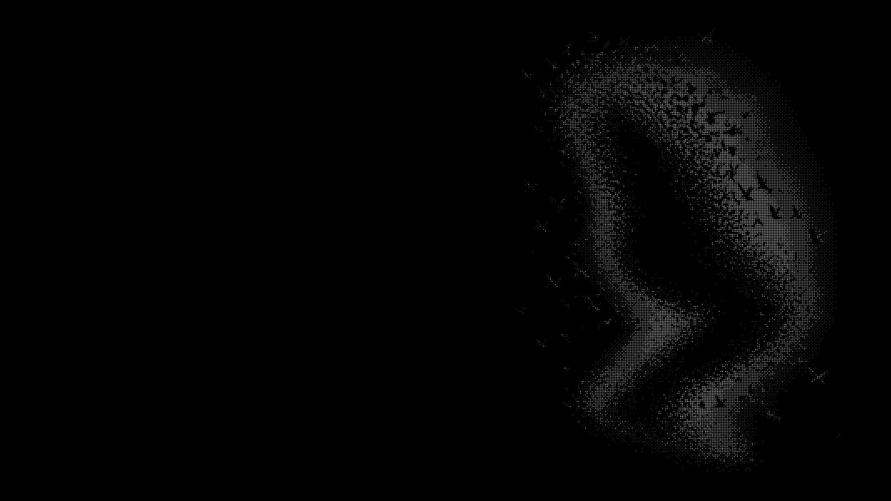

# dither-hero



Turn a generated grayscale image into a **live black-and-white dot field** — a
hero that renders every frame through an ordered dither, with particles moving
through it, a pointer warp that bends the lattice, and a scroll dissolve.

It is two things in one repo:

- **A library.** `assets/dither.js` is a dependency-free ES module. No build
  step, no framework, no network calls. Copy one file.
- **A Claude Code skill.** `SKILL.md` at the root captures the whole workflow —
  how to prompt for a source image that will actually dither, how to prepare
  it, how to frame and tune it, and the fourteen bugs that cost real time to
  find. Clone into `~/.claude/skills/` and Claude follows it.

Nine finished examples with their exact settings live in [`samples/`](samples).

## Quick start

```js
import { DitherHero } from "./dither.js";

const engine = new DitherHero(canvas, img);   // img must already be loaded
engine.resize();
engine.start();

addEventListener("pointermove", (e) => engine.setPointer(e.clientX, e.clientY));
addEventListener("pointerleave", () => engine.setPointer(null));
addEventListener("scroll", () => engine.setScroll(scrollY / heroHeight));

engine.setOptions({ grain: 8, particles: "radial" });   // retune live
```

Mark the canvas `aria-hidden="true"` and lay real DOM text beside it. Never
render type into the canvas.

## See it

```bash
python3 -m http.server 8000     # then open /samples/
```

`samples/index.html` loads all nine through the real engine with the tuning
panel attached. It is faster than reading about what the parameters do.

## The one thing that surprises people

**The engine adds the dots**, so the source image must be **smooth
continuous-tone grayscale** — full range from near-white through mid-greys to
pure black. Feed it something already stippled, halftoned or 1-bit and you get
mud or grid-on-grid moiré, and no amount of tuning rescues it.

Two corollaries worth internalising before you generate anything:

- **Dithering resolves structure, not mass.** A flock, falling debris, crumbling
  rock, architecture with edges — these have something for the lattice to
  latch onto. A single smooth object becomes a grey blob. If the subject is
  solid, give it a disintegrating edge.
- **Highlights and shadows are not enough.** A subject that is very bright
  against very dark with little in between leaves nothing to quantise. That is
  a source problem, not a settings problem.

[`references/prompts.md`](references/prompts.md) has eight subject templates
that bake this in, including the ones that were tested and failed.

## Parameters

| | |
|---|---|
| `grain` | Cell size. Bigger = chunkier. The highest-leverage knob |
| `toneSteps` | Tone levels. 2 is hard 1-bit; 4–5 is the sweet spot |
| `dotGap` / `dotFill` | Space around each dot; dot size within its cell |
| `contrast` / `brightness` / `shadowLift` | Tone, applied after the pinned auto-level |
| `blackCutoff` | Below this a cell draws nothing, keeping the void empty |
| `zoom` / `panX` / `panY` / `fit` | Framing. `contain` for a square source in a wide frame |
| `particles` | `off`, `fall`, or `radial` |

**Airiness is cell size against dot fill, not dot count.** If it reads heavy,
raise `grain` *and* lower `dotFill`. Adding dots makes it worse.

### Particles

`off` by default, because a full-screen weather layer competes with the
subject on most images. `fall` drifts down inside a box; `radial` streams
outward from a point. Emitter coordinates are in **source** space, so an
emitter stays pinned to the thing it belongs to when you change the framing —
anchor to the canvas instead and every framing tweak costs a re-tune.

The interesting uses are local: sand inside an hourglass, a ring off a staff
tip, dust pooling under an emblem. Those read as *the object doing something*
rather than ambience laid over it.

## Tuning

Nobody can specify these numbers in advance. Drop in `assets/Picker.jsx` +
`assets/picker.css` during the design phase — grouped sliders, three save
slots, and a copy-settings button — settle the values against the real art,
then paste the JSON into code and delete the panel.

For a static dithered image (a logo, an emblem), `assets/DitherMark.jsx` uses
the same Bayer matrix, tone pipeline and radius mapping. Same numbers mean the
same thing in both, which is what makes a dithered logo look like it belongs
to the dithered hero rather than merely resembling it.

## Debugging

Read [`references/pitfalls.md`](references/pitfalls.md) first. It is indexed by
**symptom**, because that is all you know when you arrive: static-looking
particles, teleporting dots near the cursor, density that pulses, grey mush,
an animation that freezes after a second, a subject no pan value can frame.
Every entry is a bug that actually shipped.

## Notes

Requires `<canvas>` and ES modules. Respects `prefers-reduced-motion` by
painting one static frame. `requestAnimationFrame` does not fire when
`document.hidden` is true, so in a headless or background tab the field will
look frozen even though the engine is healthy — drive it manually with
`engine.draw(1/15)` to verify.

## Stills

The hero is a live canvas, so there is no frame to export in a build step.
`scripts/render_still.py` ports the engine's quantisation — same Bayer matrix,
same pinned non-void auto-level, same radius-by-level mapping — for social
cards, README images and print:

```bash
python3 scripts/render_still.py murmuration.png out.png --width 1600
```

It skips the particle layer, since a frozen frame of moving particles is
misleading; use it on presets with `"particles": "off"`. Measured against the
live engine it lands within ~12% of its ink coverage, the residual being PIL's
non-antialiased rasteriser against the browser's antialiased arcs at sub-pixel
radii. Not visible, but not pixel-identical either.

## Licence

Code is MIT — see [LICENSE](LICENSE).

The sample images in `samples/img/` are AI-generated and included so the demo
works out of the box. Two of them (`e2-ice`, `e1-stone`) spell a specific
project's name; swap them for your own wordmark rather than shipping someone
else's.
